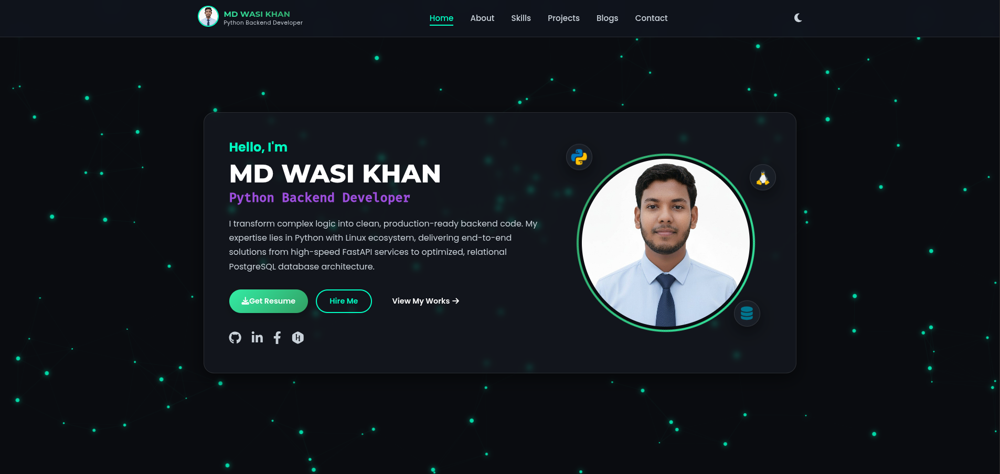
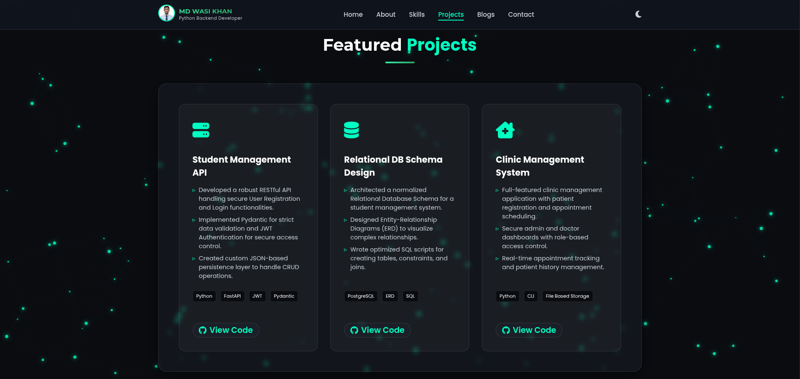
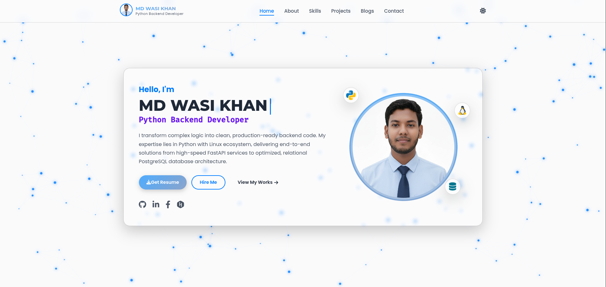
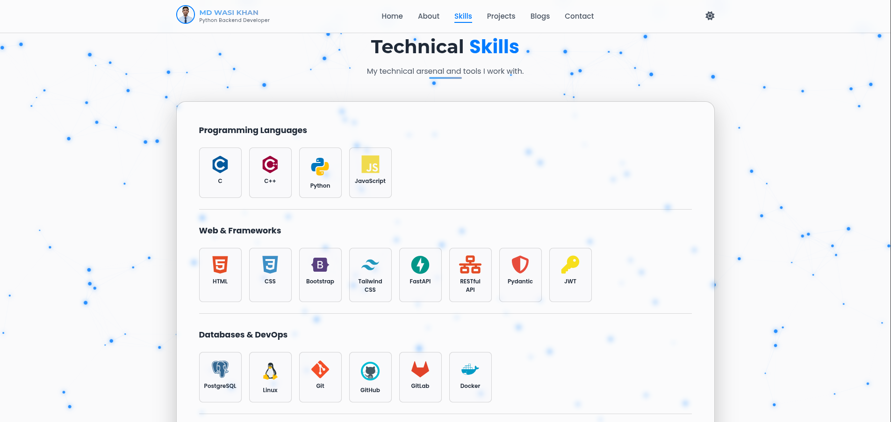

# MD WASI KHAN - Personal Portfolio Website 🔥

**Live Demo:** [https://mdwasikhan-portfolio.netlify.app/](https://mdwasikhan-portfolio.netlify.app/)

This repository contains the complete source code for my modern, single-page personal portfolio website. Built entirely with **HTML5, CSS3, and Vanilla JavaScript** — no frameworks or external libraries — it showcases my journey and skills as a **Python Backend Developer**.

The design emphasizes a premium, modern aesthetic with glassmorphism effects, interactive animations, and flawless responsiveness across all devices.

## ✨ Key Features

- **Custom Interactive Particle Background** — Canvas-based moving particles with dynamic connecting lines (pure JS, no external libraries)
- **Smooth Typing Animation** — Hero section with realistic typing effect and permanent blinking cursor
- **Dark / Light Theme Toggle** — Fully adaptive colors, persisted via localStorage
- **Glassmorphism UI** — Frosted glass containers with backdrop blur and subtle shadows
- **Rotating Profile Border & Floating Skill Icons** — Eye-catching hero enhancements
- **Smooth Scroll Navigation** — Active section highlighting + mobile hamburger menu
- **Fully Responsive Design** — Optimized for desktop, tablet, and mobile (including very small screens)
- **Performance Focused** — Lightweight, fast-loading static site

## 🛠 Tech Stack

- **HTML5** — Semantic and clean structure
- **CSS3** — CSS variables, Flexbox, Grid, custom animations, glass effects
- **Vanilla JavaScript** — Typing effect, particles, theme toggle, mobile menu, scroll spy
- **Fonts** — Poppins, Montserrat, Fira Code (Google Fonts)
- **Icons** — Font Awesome 6 & Devicon


## 📂 Project Structure
.
├── home.html          # Single-page HTML file
├── style.css          # All styles with CSS variables for theming
├── script.js          # All interactive logic (typing, particles, theme, menu, etc.)
├── Image/             # Profile photos, blog thumbnails, icons, and screenshots
└── README.md          # This file
text## 📸 Screenshots

### Dark Mode (Default)





### Light Mode





*(Add your own screenshots to the `Image/` folder and update the file names above if needed)*

## 🏗️ Local Setup


1.  **Clone the Repository:**
    ```bash
    git clone https://github.com/mdwasikhan54/mdwasikhan-portfolio.git
    ```

2.  **Navigate to the Project Directory:**
    ```bash
    cd mdwasikhan-portfolio
    ```

3.  **Launch:**
    Open the **`home.html`** file directly in your web browser.

---

### 👨‍💻 Developed by [MD WASI KHAN](https://mdwasikhan-portfolio.netlify.app/) 

[](https://github.com/mdwasikhan54)
[](https://linkedin.com/in/mdwasikhan54)
</div>

If you find this project helpful, please drop a ⭐ star on the repo\!
